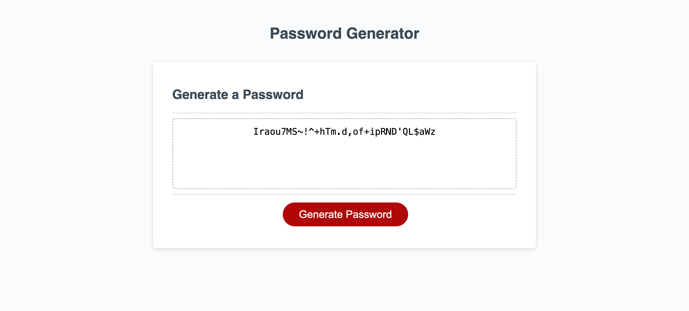

# Password Generator

##  Description

The project is designed to create a secure password for the user. The task was required for Week 5 Bootcamp Exercise. The starter codes were provided by EdX Bootcamp. The generated password can be 8 to 128 characters long and the user can choose whether to have numeric, lowercase, uppercase and special characters for the password. After answering the questionnaire the user find the password written on the screen. 

##  Table of Contents
<!-- vscode-markdown-toc -->
*  [Deployed Page](#DeployedPage)
*  [Installation](#Installation)
*  [Credits](#Credits)
*  [License](#License)

<!-- vscode-markdown-toc-config
	numbering=true
	autoSave=true
	/vscode-markdown-toc-config -->
<!-- /vscode-markdown-toc -->

##  Deployed Page
- 

- [Deployed Github Page](https://beatak777.github.io/password-generator)

##   Installation
No Installation necessary although it is not forbidden to do so. If you decide to install here are the steps for you:
1. Download or clone repository
3. Navigate to project directory
2. Open index.html in your browser
3. Answer the questions and you will find your generated password.
4. Copy and paste your password and save it for future purposes.

##   Credits

- Default files provided by [edX Bootcamp](https://www.edx.org/course/skills-bootcamp-in-front-end-web-development).
- Code refactoring by [Bea Konya](https://github.com/beatak777).
- Additional guidance received from [Mdn Web Docs](https://developer.mozilla.org/en-US/docs/Web/JavaScript/) that helped me understand JavaScript on a deeper level through the description of Nan, concat, math.floor and for statements.
- Extra information was used from [Web Dev Simplief](https://www.youtube.com/watch?v=7L2RLBmEJmE) in order to solve this challenge.
- Additional information was utilised from [Udemy JavaScript Course](https://www.udemy.com/share/101txa3@6pzxirXvN0duOQu1KxGSBF5Ij6A0SIUgputWKUMnu7eJh1w5GzhjGqCji83ZOjbe/) as I am a beginner.
- Table of Contents was Created with the Visual Studio Code Extension 'Markdown TOC' available [here](https://marketplace.visualstudio.com/items?itemName=dumeng.markdown-toc).
- Special thanks to my friend Shlomi Shperling who also helped me understand this project a bit better.

##   License
MIT License.
For further information please refer to the LICENSE in the repo.